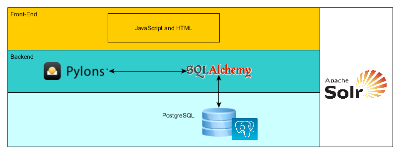

.. _ckan-architecture:

###################
System Architecture
###################

========
Overview
========

CKAN (Comprehensive Knowledge Archive Network) is a free and open-source web-based DMS (Data Management System). It is the world’s leading open-source data portal platform for the storage and distribution of data. CKAN provides powerful tools for cataloging, storing, publishing, sharing and accessing data via rich front-end, powerful API, harvesting, searching, visualisation tools, etc.

CKAN is based on the open-source tools below:

- Backend: Python
- Frontend: Javascript
- ORM: Pylons and SQLAlchemy
- Database engine: PostgreSQL
- Search engine: SOLR

CKAN has a modular architecture and by adding extensions can provide diverse features such as harvesting, comments, analytics, data upload, or link checking. Over 60 extensions under the Open Source licence are ready for downloading and usage. A robust API gives opportunity to integrate third-party applications and services.

=============
CKAN features
=============

CKAN not only stores the data, but makes it discoverable and presentable. This mature and highly customisable DMS takes care of theming, metadata, federating, storing, searching and managing data. Main features are:

- Intuitive and easy-to-use web interface
- Publisher’s admin dashboard for managing members, datasets, approving for publication, etc.
- Fine-grained and tuned authorization access
- Add and edit datasets via the web interface, JSON API, or custom spreadsheet importers
- Sophisticated “harvesting” mechanism
- Workflow involves public and private datasets
- Store the raw data and metadata
- Visualisation of structured data via interactive tables, graphs and maps
- All dataset fields are searchable
- Keyword search, filter by tags, browsing between related datasets
- Fuzzy-matching (search for closely matching terms instead of exact matches)
- See dataset information at a glance
- A rich set of metadata (title, unique identifier, groups, description, licence, tags, etc.)
- Versioned Domain Model (VDM) keeps a full history of all edits and versions
- Advanced geospatial features
- Statistics and usage metrics for datasets

Data can be stored in any format. There is a rich RESTful JSON API for structured data that allows users to access, query, retrieve and use data instantly after uploading. Users don’t need to download or process datasets first. An API gives access to stored data, full searching capabilities, dataset information, usage statistics, etc.

Data uploaded or linked as a .csv or Excel table is loaded into a database. The basic visualisation view is a table. The user can perform a number of operations, including sorting data on particular columns, filter or facet by values, or hide columns entirely. Data can also be displayed on a customized graph or diagram. In case the table has columns that CKAN recognises as latitude and longitude, data can be plotted into a map. If a resource is an image or a web page, it will be displayed directly in the CKAN via built-in previews. Developers can even create additional visualisation tools so that users could view data in more specific formats without downloading it.

Harvesting was developed to facilitate the process of importing data from different existing repositories. This mechanism allows regular records pulling into CKAN from the following sources: simple HTML index pages, Web Accessible Folders, existing web catalogues, Geospatial CSW Servers, ArcGIS, Geoportal Servers and Z39.50 databases, or other CKAN instances.

CKAN boasts geospatial features that allow filtering the results by geographical location. When CKAN receives structured data with location information, it can understand a location associated with a dataset, plot the data on an interactive map and use this to offer geospatial search capabilities through the web interface and API. Also CKAN includes capabilities to import geo-coded metadata in several formats and make it queryable according to the INSPIRE standard.

